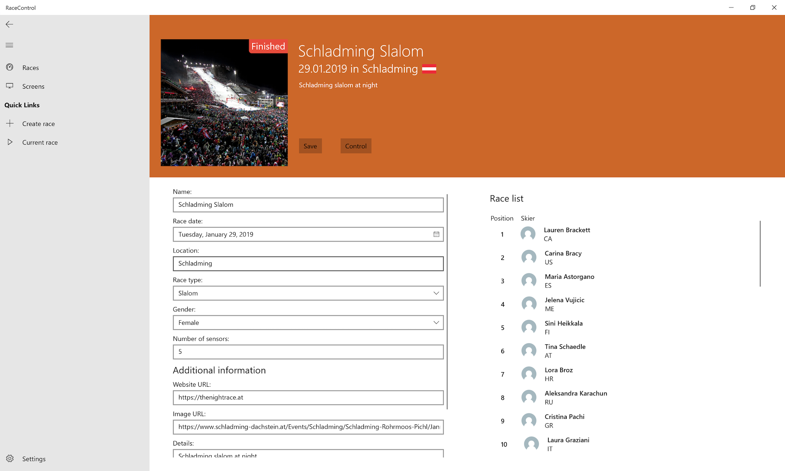
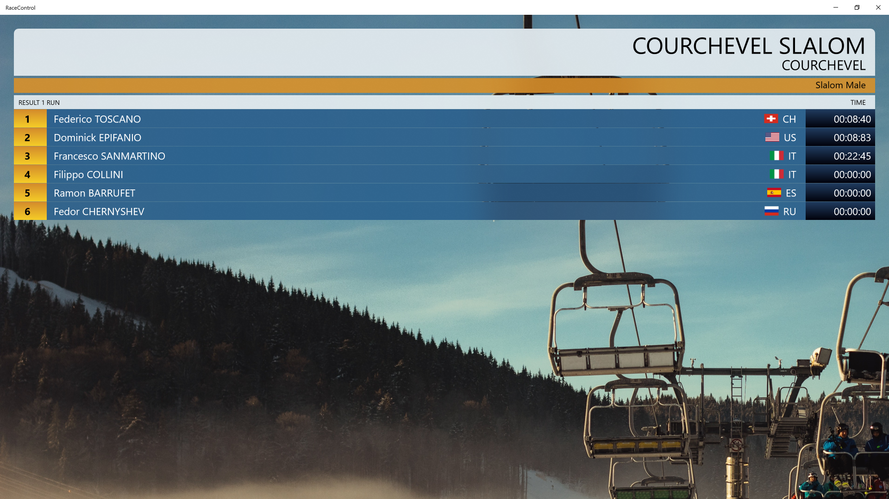
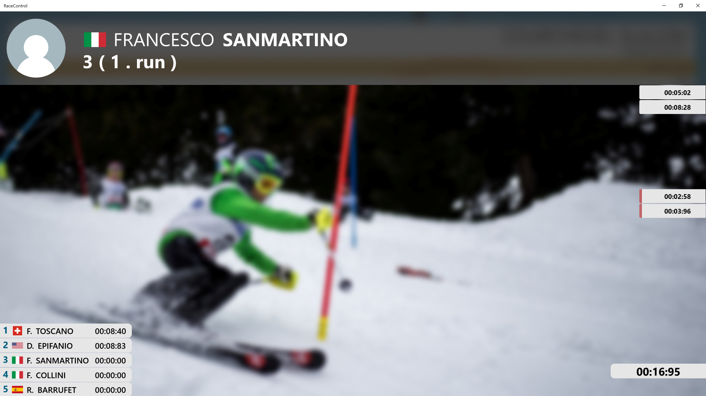

# Hurace (Ammer, Vitturi)

A system to manage ski events and skiers. This project is based on an exercise in SWK5UE WS1920 at FH OÖ Campus Hagenberg.

## 📋 Solution Structure

**Hurace.Api**  
Server providing a web REST API for Hurace.Web.

**Hurace.Core**  
Business logic and data access and persistency layer implementation.

**Hurace.Core.Interface**  
Definition of functionalities provided by the data access layer and business logic in form of C# interfaces.

**Hurace.Core.Mapper**  
Object-Relational Mapper that can serialize and deserialize domain classes to and from SQL databases in a generic manner.

**Hurace.Core.Test**  
Unit tests for business logic and data access layer.

**Hurace.Domain**  
"Plain Old CLR Objects" used by the business logic to represent data.

**Hurace.RaceControl**  
Universal Windows Platform application to view and manipulate the data.

**Hurace.Simulator**  
Implementation of Hurace.Timer with manual controls in a graphical user interface.

**Hurace.Timer**  
Assignment-specified `IRaceClock` interface.

## 🏗️ Data model

## 🎪 Showcase UWP

## 📃 License

