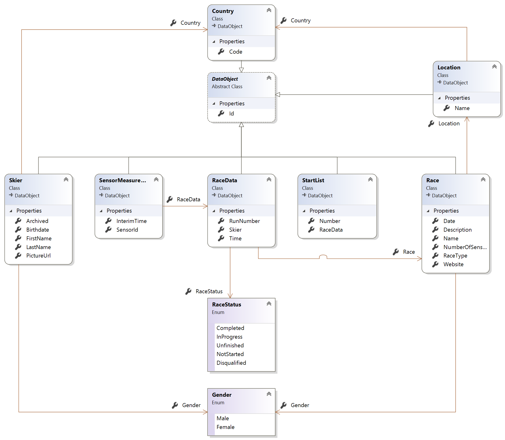
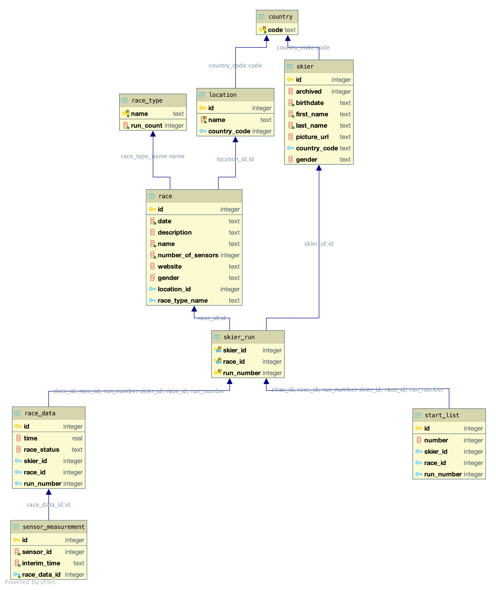

# Data model

Classes in the application logic (.NET classes) and relational entities (SQL tables) have been modeled to be a one-to-one representation of each other, besides a few exceptions for enumerations. Each entity has the same attributes (properties in .NET, columns in SQL) and connections to other entities (refernces in .NET, foreign keys in SQL).

*`DataObject`*
: An abstract entity that is uniquely identified by an integer `Id` which constitutes its primary key. This serves as base class for all other classes that fullfill this characteristic.

`Skier`
: Participant of ski competitions.

`Race`
: Ski competition where which multiple skiers can partecipate. This entity only stores organizational information about the race. Depending on the type of the race `RaceType`, a race can have one or two *runs*, that is the number of parts the race is divided into.

`RaceType`
: Can be on of the following: Downhill, Super-G, Slalom, Giant Slalom.  
Slalom races are divided into two runs, other types only require one run.

`RaceData`
: A concrete performance of a skier in a competition, that is either the first or second run of a race.

`SensorMeasurement`
: A measurement performed by `Hurace.Timer` during a race. The measurement is related to a concrete run, which means it has a connection to a `Skier`, `RaceData`, and indirectly to `Race`.

`StartList`
: The assignment of a starting position to each skier for each run in a race.

`Country`
: A country a skier can be from, or a race take place in.

`Location`
: The place a race can take place in.

`Gender`
: The gender a skier can be, or a race can be for.

`RaceStatus`
: The status of a run. Can represent whether a run is currently being performed, the end state of a run (completed or unfinished), or a disqualification.

# Solution structure

## `Hurace.Core`

`ConfigurationReader` is a static class that reads the `appsettings.json` file where configurations for the runtime are set. The configuration file contains settings for different running environment (`Production`, `Testing`, `Debug`). The only setting available for the moment is `ConnectionStrings`.

`ConnectionFactory` is a class that provides a `DbConnection` used by the DAOs to access the database. The factory takes care of initializing the database by running the `Scripts/create_tables.sql` script in case the database wasn't initialized before. Support for shared in-memory databases is also provided, and enables the creation on-the-fly of volatile databases useful for the testing environment.

`Daos` are the Data Access Object implementation (DAO) of their relative interfaces from `Hurace.Core.Interface`. The DAOs provide a set of methods to insert, retrieve, update, delete the domain classes in the database. Each operation is implemented generically by `DataObjectDao`, from which all other DAOs are derived, with the helper of `Hurace.Mapper`.

## `Hurace.Core.Interface`

This project contains the interfaces for the DAOs, that is for each class domain a set of operations is defined. As needed, methods will be added to provide a useful and comfortable access of the domain classes to the business logic.

## `Hurace.Core.Test`

This project contains tests for the classes in `Hurace.Core`, that is `ConnectionFactory` and the DAOs. The tests make use of the xUnit.net unit testing tool.

All tests that need a database make use of the functionality provided by `ConnectionFactory` to obtain a fresh new database that lives in memory. This means each test method can have a completely independent database and solve the problem of tests potentially influencing each other.

## `Hurace.Domain`

This project contains all the domain classes, which are classes used by the business logic to store information. Domain classes are serialized/deserialized by their relative DAO to be persisted/retrieved to/from a database.

## `Hurace.Mapper`
The Mapper project is a simple object mapper that is responsible for mapping between the database and the programming language. It also adds extension methods for DbConnections to query a database.

To enable the mapper, you use one of the provided attributes. 

* Table: Defines the table name of the class in the database.
* Column: Defines the column name of a property in the database.
* ForeignKey: Defines the foreign key column name.
* Id: Indicates that the property is the primary key.
* Required: Indicates that the column must not be null.

The following methods can be used to communicate with the database.

* Get<T>(id): Returns a single entity by a unique id.
* GetAll<T>(): Returns a list of entities.
* Insert<T>(newObject): Inserts an entity and returns an id.
* Update<T>(updatedObject): Updates an entity.
* Delete<T>(id): Deletes an entity.

All of these extensions rely on one of the base methods `Execute` or `Query`.

**Info**

* Inner objects do not get resolved at the moment.
* An object can only have one property with the Id attribute.
* Required attributes are not checked.