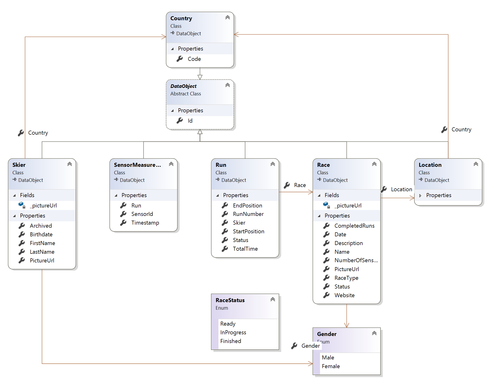

# Data model

Classes in the application logic (.NET classes) and relational entities (SQL tables) have been modeled to be a one-to-one representation of each other, besides a few exceptions for enumerations. Each entity has the same attributes (properties in .NET, columns in SQL) and connections to other entities (refernces in .NET, foreign keys in SQL).

*`DataObject`*
: An abstract entity that is uniquely identified by an integer `Id` which constitutes its primary key. This serves as base class for all other classes that fullfill this characteristic.

`Skier`
: Participant of ski competitions.

`Race`
: Ski competition where which multiple skiers can partecipate. This entity only stores organizational information about the race. Depending on the type of the race `RaceType`, a race can have one or two *runs*, that is the number of parts the race is divided into.

`RaceType`
: Can be on of the following: Downhill, Super-G, Slalom, Giant Slalom.  
Slalom races are divided into two runs, other types only require one run.

`RaceData`
: A concrete performance of a skier in a competition, that is either the first or second run of a race.

`SensorMeasurement`
: A measurement performed by `Hurace.Timer` during a race. The measurement is related to a concrete run, which means it has a connection to a `Skier`, `RaceData`, and indirectly to `Race`.

`StartList`
: The assignment of a starting position to each skier for each run in a race.

`Country`
: A country a skier can be from, or a race take place in.

`Location`
: The place a race can take place in.

`Gender`
: The gender a skier can be, or a race can be for.

`RaceStatus`
: The status of a run. Can represent whether a run is currently being performed, the end state of a run (completed or unfinished), or a disqualification.
