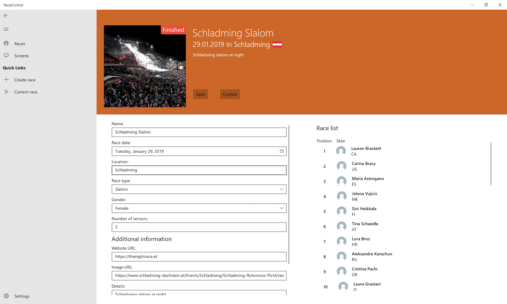

# Race Control

The race control is an UWP app which consists of five screens to control all the races. The home screen shows all available races and also offers the possibility to search for a specific range. On the left side you can use the navigation view to navigate through the app.

## Problems with UWP

* The UWP TextBox does not implement the `INotifyDataErrorInfo` (see [Issue 179](https://github.com/microsoft/microsoft-ui-xaml/issues/179))
* x:Bind does not support UpdateSourceTrigger
* x:Bind does not support StringFormat
* NavigationView does not support Command (see [Issue 944](https://github.com/microsoft/microsoft-ui-xaml/issues/944))
 
# Simulator

The simulator provides a simple way to send time impulses for testing and demonstration purposes. It is composed by an implementation of `IRaceClock` and an view and related view controller.

The implementation of `SimulatorRaceClock` is trivial since it only provides a public method `SendImpulse` to trigger the `TimingTriggered` from `IRaceClock` with an artificial sensor identifier.

The view model to control the simulator takes an instance of `SimulatorRaceClock`, on which a bound `Command` `SendTimerImpulse` will call the clock's method that will trigger an event. The UI provides an input for the sensor identifier that, for convenience, is automatically incremented every time an impulse is sent, and reset to 0 after defined amount of impulses has been sent, so that the user can continually click to send impulses.

# Services

In order to access the data access objects (DAOs) the view controllers, and eventually the web API backend, communicate with a business logic layer divided into multiple *services*.

The services implement the business logic and provide an interface to control an manipulate the application's data in a way that avoids inconsistent or invalid states.

Each service may need one or more DAO implementations for each entity it updates or needs information from. An helper class `DaoProvider` has been created in order to collect all DAO implementations so to be passed to each service, which will then have all DAOs at its availability. The helper class simply takes all DAOs (`ICountryDao`, `ILocationDao`, `IRaceDao`, `IRunDao`, `ISensorMeasurementDao`, `ISkierDao`) in the constructor an makes them available as public properties.

# Testing

To isolate the testing of the services (business logic), the Moq framework  has been used. This mocking framework offers many features that allow to create objects that conform to an interface and dynamically add implementations for only specific methods when required by the test. This ease in the creation of tests since the mocked object can be made to act in a pre-defined way and for example return test-specific data.

The tests follow the Arrange-Act-Assert pattern (or alternatively Setup-Execute-Assert). In the Setup stage, the mock implementations of the necessary DAOs methods are dynamically created and an instance of the service to test is initialized with the mocked DAOs injected.

Some tests make use of spy tests, which is a feature provided by Moq to check how many times a method of a mocked object has been called, and enables to quickly check whether some branch of the tested method has been reached.