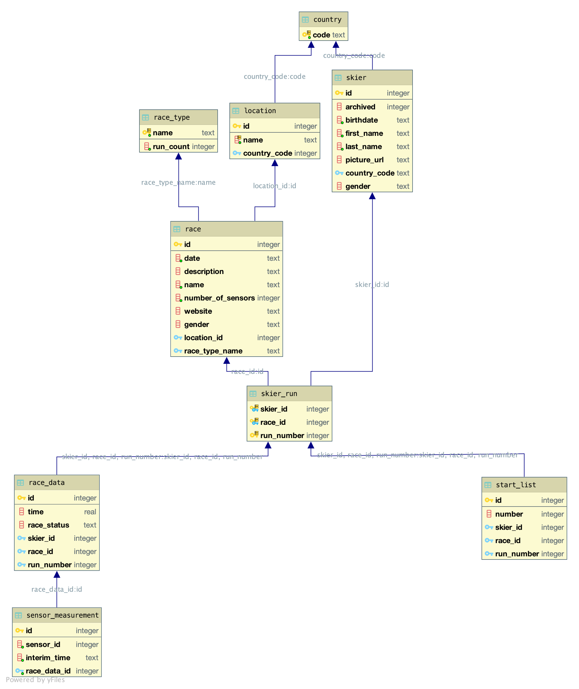
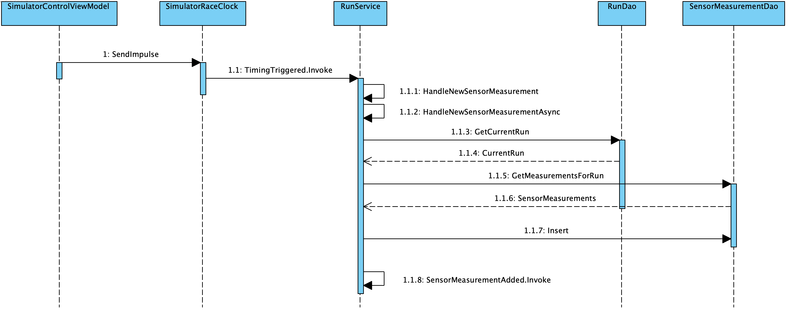
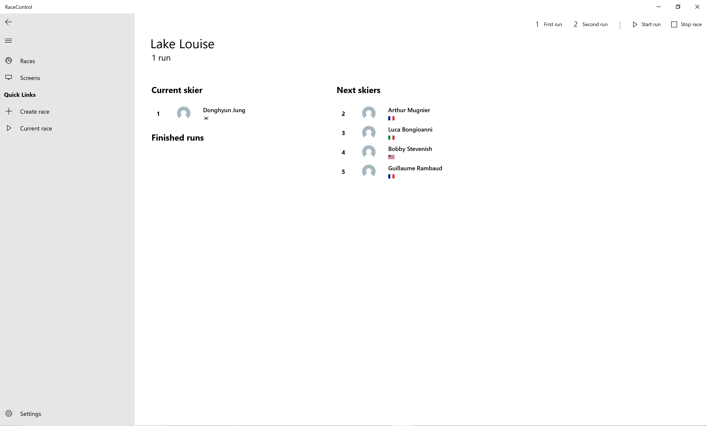
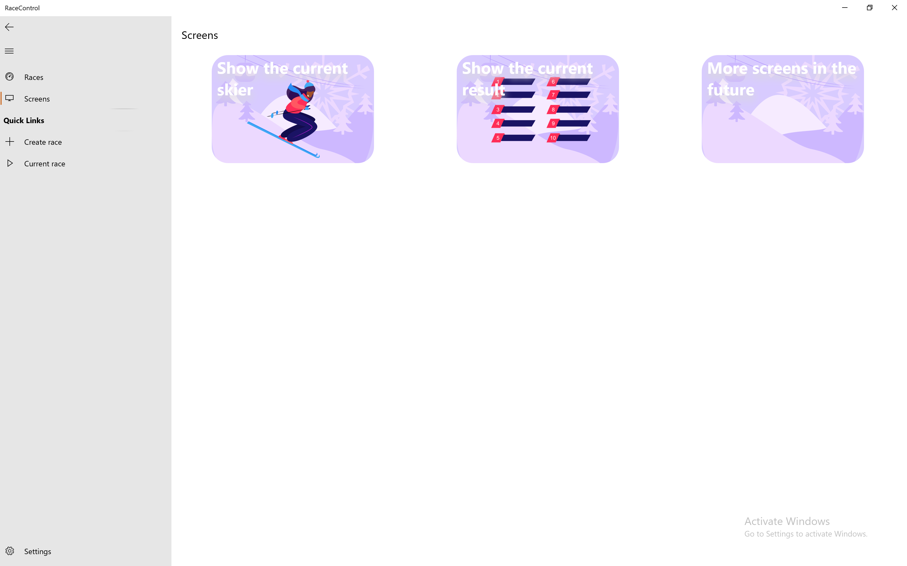
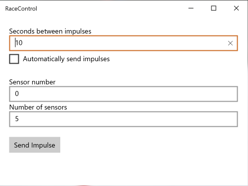

# Solution Structure

**Hurace.Api**  
Server providing a web REST API for Hurace.Web.

**Hurace.Core**  
Business logic and data access and persistency layer implementation.

**Hurace.Core.Interface**  
Definition of functionalities provided by the data access layer and business logic in form of C# interfaces.

**Hurace.Core.Mapper**  
Object-Relational Mapper that can serialize and deserialize domain classes to and from SQL databases in a generic manner.

**Hurace.Core.Test**  
Unit tests for business logic and data access layer.

**Hurace.Domain**  
"Plain Old CLR Objects" used by the business logic to represent data.

**Hurace.RaceControl**  
Universal Windows Platform application to view and manipulate the data.

**Hurace.Simulator**  
Implementation of Hurace.Timer with manual controls in a graphical user interface.

**Hurace.Timer**  
Assignment-specified `IRaceClock` interface.

# Data Storage

## Models

Classes in the application logic (.NET classes) and relational entities (SQL tables) have been modeled to be a one-to-one representation of each other, besides a few exceptions for enumerations. Each entity has the same attributes (properties in .NET, columns in SQL) and connections to other entities (refernces in .NET, foreign keys in SQL).




***DataObject***  
An abstract entity that is uniquely identified by an integer `Id` which constitutes its primary key. This serves as base class for all other classes that fullfill this characteristic.

**Country**  
A class representing the country a `Skier` can be from, or a `Location` can be part of.

**Gender**  
An enumeration representing the gender a `Skier` can be, or a `Race` can be for.

**Location**  
A class representing the place a `Race` can take place in.

**Race**  
A class representing a ski competition where multiple `Skier`s can partecipate to. This entity only stores organizational information about the race. Depending on the type of the race `RaceType`, a race can have one or two `Run`s, that is the number of parts the race is divided into.

**RaceStatus**  
An enumeration representing the whether a `Race` competition is over, currently in progress or yet to start.

**RaceType**  
An enumeration representing of which of the following a `Race` is the type of: Downhill, Super-G, Slalom, Giant Slalom. Slalom races are divided into two `Run`s, other types only require one `Run`.

**Run**  
A class representing a concrete performance of a `Skier` in a `Race`, that is either the first or second run of a race.

**RunStatus**  
An enumeration representing whether a `Run` is currently being performed, its end state (completed or unfinished), or a disqualification.

**SensorMeasurement**  
A measurement performed by `Hurace.Timer` during a race. The measurement is related to a concrete `Run`, which means it has a connection to a `Skier` and `Race`.

**Skier**  
A class representing a participant of ski competitions.


## Data Access Objects

The DAOs provide a set of methods to insert, retrieve, update, delete the domain classes in the concrete storage provider, that is a SQLite database. Each operation is implemented generically by `DataObjectDao`, from which all other DAOs are derived, with the helper of `Hurace.Core.Mapper`.

`ConnectionFactory` is a class that provides a `DbConnection` used by the DAOs to access the database. The factory takes care of initializing the database by running the `Scripts/create_tables.sql` script in case the database wasn't initialized before. Support for shared in-memory databases is also provided, and enables the creation on-the-fly of volatile databases useful for the testing environment.

## SQLite

SQLite was chosen as database management system since it is self-contained and does not introduce the need for a separate component when the application is started, as would a MySQL database that requires a server running.

A file-based database management system is also an appropriate storage type for desktop application since it allows the data to be portable, easily backed up and restored, but ease the testing phase with swappable instances.

Despite many misconceptions, SQLite provides a locking mechanism and allows for concurrency making it feasable to have multiple clients accessing the data, in this case the UI and web API.

## Object-Relational Mapper

The Hurace.Core.Mapper project is a simple object mapper that is responsible for mapping between the database and the programming language. It also adds extension methods for `DbConnections` to query a database.

To enable the mapper, you use one of the provided attributes. 

**`Table`**  
Defines the table name of the class in the database.

**`Column`**  
Defines the column name of a property in the database.

**`ForeignKey`**  
Defines the foreign key column name.

**`Id`**  
Indicates that the property is the primary key.

**`Required`**  
Indicates that the column must not be null.

**`Ignore`**
Specifies that the column should be ignored when inserting or updating an object.

The following methods can be used to communicate with the database.

**`Get<T>(id)`**  
Returns a single entity by a unique id.

**`GetAll<T>()`**  
Returns a list of entities.

**`Insert<T>(newObject)`**  
Inserts an entity and returns an id.

**`Update<T>(updatedObject)`**  
Updates an entity.

**`Delete<T>(id)`**  
Deletes an entity.

All of these extensions rely on one of the base methods `Execute` or `Query`.

# Web API

## OpenAPI

The web server makes use of Swagger to provide an OpenAPI definition for the REST API used by Hurace.Web.

When registered, the Swagger middleware will dynamically collect all the API endpoints at runtime and describe them in a JSON format compatible with other OpenAPI implementations.

The generated document `https://localhost:5001/swagger/v1/swagger.json` allows OpenAPI-aware tools, such as [**OpenAPI Generator**](https://github.com/OpenAPITools/openapi-generator) to programmatically adapt to the REST API. In the case of Hurace.Web, an NPM package that provides access to all the API endpoints in form of Angular services and models can be generated.

<!-- ## Models -->

<!-- ## Controllers -->

## FluentValidation

In order to check whether the data recived by a client is valid, [FluentValidation](https://fluentvalidation.net) is used to define custom rules on how the input must look like to be compatible with the business logic services.

Each parameter in an endpoint method of a controller can have a FluentValidation attribute that will be matched against a defined set of rules. If the check is not successful, the request will automatically marked as invalid and a response with status code 400 is sent to the client without the need of manually handling such error cases.

```c#
public async Task<ActionResult<Skier>> CreateSkier(
	[CustomizeValidator(RuleSet = "CreateSkierValidation")]
)
{
	var insertedSkier = await _skierService.CreateSkier(skier);
    return CreatedAtRoute("GetSkierById",
    	new {id = insertedSkier.Id}, insertedSkier);
}

```

A set of matching rules in the Angular Hurace.Web client can be used to provide immediate feedback to the user trying to modify or create a resource before submitting the request to the server and receiving an error message.

# Business Logic

The first sequence diagram visualizes the flow when the web app wants to retrieve the sensor measurements for the current run.


The second diagram show the steps which are eecuted when a new sensor measurement is added.



## Services

In order to access the data access objects (DAOs) the view controllers, and the web API backend, communicate with a business logic layer divided into multiple *services*:

- `CountryService`
- `LocationService`
- `RaceService`
- `RunService`
- `SkierService`

The services implement the business logic and provide an interface to control an manipulate the application's data in a way that avoids inconsistent or invalid states.

`RunService` and `RaceService` are also of particular importance since, as opposed to the other services that provide a brige to their relative DAOs, the services for `Run` and `Race` provide the interface for Race Control to trigger all of the business logic in an automated way, such as: generating a reversed start list when the first run is over, generating the leaderboard when a skier has finished a run, handling new sensor measurements.

Moreover these two services are responsible for signaling to the Race Control that data has changed in order to provide an graphical interface that reacts to data changes. This is done by exponsing a few events the UI is going to subscribe to and triggering them as new data is processed.

Each service may need one or more DAO implementations for each entity it updates or needs information from. An helper class `DaoProvider` has been created in order to collect all DAO implementations so to be passed to each service, which will then have all DAOs at its availability. The helper class simply takes all DAOs (`ICountryDao`, `ILocationDao`, `IRaceDao`, `IRunDao`, `ISensorMeasurementDao`, `ISkierDao`) in the constructor an makes them available as public properties.

# Graphical User Interface

The race control is an UWP app to control all the races. 

This page shows all created races and also let's the user search for specific races. The side navigation on the left allows a quick navigation between the most important screens.


This screen can be used to create new races and also update them. Unfortunately UWP does not implement `INotifyDataErrorInfo` on text boxes and therefore no error indicator are displayed. On the right half the user can edited the start list.


This page is used to control the race by releasing skiers, stopping a race, disqualify skiers and switching to the second run.



This screen allows to create new windows which show the current result or the current skier.



The current result screen shows the currentleader board.


The current skier screen shows the current skier and also the current position in the race.


## Universal Windows Platform

The client is realized with the Universal Windows Platform and a helper library called [Windows Community Toolkit](https://docs.microsoft.com/en-us/windows/communitytoolkit/).

## MvvmCross

MvvmCross is a convention based MVVM framework for Xamarin and Windows. The main usages of these library are listed below:

* Dependeny injection of services
* Navigation between ViewModels with the `IMvxNavigationService`
* Communication between ViewModels with the `MvxMessengerHub`
* Custom `MvxWindowsViewPresenter` to allow the creation of new windows (e. g. current result screen)
* Custom `DialogService` with the `IMvxMessenger`

### Dependency Injection

By specifying a class which inherits from `MvxApplication`, all services can be registered as singletons and therefore every ViewModel can access them if needed.

```
public override void Initialize()
{
    var daoProvider = new DaoProvider(countryDao, locationDao, raceDao, runDao, sensorMeasurementDao, skierDao);
    var messengerHub = new MvxMessengerHub();
    var simulatorRaceClock = new SimulatorRaceClock();
    Mvx.IoCProvider.RegisterSingleton<IMvxMessenger>(messengerHub);
    Mvx.IoCProvider.RegisterSingleton<IDialogService>(new DialogService(messengerHub));
    Mvx.IoCProvider.RegisterSingleton<IRaceService>(new RaceService(daoProvider));
    Mvx.IoCProvider.RegisterSingleton<ILocationService>(new LocationService(daoProvider));
    Mvx.IoCProvider.RegisterSingleton<ISkierService>(new SkierService(daoProvider));
    Mvx.IoCProvider.RegisterSingleton<IRunService>(new RunService(daoProvider, simulatorRaceClock));
    Mvx.IoCProvider.RegisterSingleton<SimulatorRaceClock>(simulatorRaceClock);

    RegisterAppStart<ViewModels.NavigationRootViewModel>();
}
```

## Limitations of UWP

* The UWP TextBox does not implement the `INotifyDataErrorInfo` (see [Issue 179](https://github.com/microsoft/microsoft-ui-xaml/issues/179))
* NavigationView does not support Command (see [Issue 944](https://github.com/microsoft/microsoft-ui-xaml/issues/944))
* x:Bind does not support StringFormat without a converter (see [String format using UWP and x:Bind](https://stackoverflow.com/questions/34026332/string-format-using-uwp-and-xbind/34026544))
* UWP does not support IMultiValueConverter

# Simulator



The simulator provides a simple way to send time impulses for testing and demonstration purposes. It is composed by an implementation of `IRaceClock` and an view and related view controller.

The implementation of `SimulatorRaceClock` is trivial since it only provides a public method `SendImpulse` to trigger the `TimingTriggered` from `IRaceClock` with an artificial sensor identifier.

The view model to control the simulator takes an instance of `SimulatorRaceClock`, on which a bound `Command` `SendTimerImpulse` will call the clock's method that will trigger an event. The UI provides an input for the sensor identifier that, for convenience, is automatically incremented every time an impulse is sent, and reset to 0 after defined amount of impulses has been sent, so that the user can continually click to send impulses.  
Alternatively, it is possible to set the simulator to send an impulse after a set amount of time. This is implemented by starting a `DispatcherTimer` accordingly to a checkbox in the UI.

## Error Handling

Since the sensors are not supposed to be completely reliable, the simulator allows the user to send "incorrect" impulses in order to simulate a sensor not behaving correctly.

When the business logic recives a sensor measurement to be handled it makes sure it is valid by checking whether the sensor identifier is following the previously saved measurement. This means sensor measurements are only considered when received in the correct order.

# Testing

## In-Memory Database

Given the flexibility provided by SQLite, it is possible to create and manage databases in memory without persisting anything to disk.

All tests that need a database make use of the functionality provided by `ConnectionFactory` to obtain a fresh new database that lives in memory. This means each test method can have a completely independent database and solve the problem of tests potentially influencing each other.

## Moq

To isolate the testing of the services (business logic), the Moq framework  has been used. This mocking framework offers many features that allow to create objects that conform to an interface and dynamically add implementations for only specific methods when required by the test. This ease in the creation of tests since the mocked object can be made to act in a pre-defined way and for example return test-specific data.

The tests follow the Arrange-Act-Assert pattern (or alternatively Setup-Execute-Assert). In the Setup stage, the mock implementations of the necessary DAOs methods are dynamically created and an instance of the service to test is initialized with the mocked DAOs injected.

Some tests make use of spy tests, which is a feature provided by Moq to check how many times a method of a mocked object has been called, and enables to quickly check whether some branch of the tested method has been reached.
